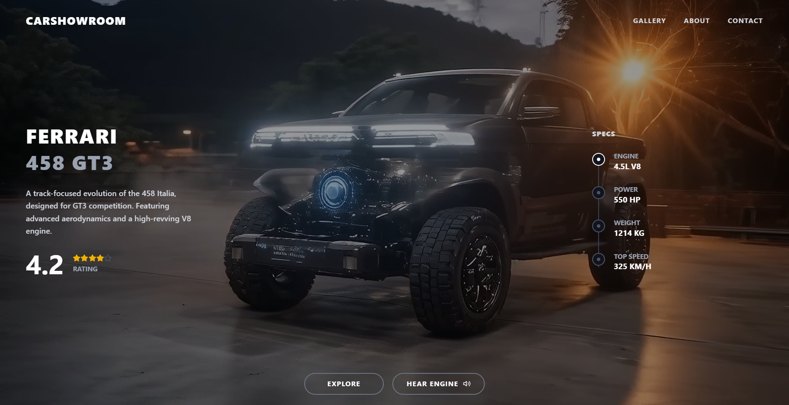

# Car Showroom Web App

A sleek, premium, dark-themed web application showcasing a high-performance car with a background video, responsive layout, and interactive audio features. Built with modern web technologies including React, Vite, and Tailwind CSS v4.

**Live Demo:** [https://devsanlphyocarshowroom.vercel.app/](https://devsanlphyocarshowroom.vercel.app/)



## Features

- 🎥 **Immersive Background Video**: A full-page, looping, muted video creates a dynamic and premium atmosphere.
- 📱 **Fully Responsive**: The layout degrades gracefully to a single column on mobile devices.
- 🍔 **Hamburger Menu**: A smooth, full-screen slide-in menu from the left for mobile navigation.
- 🔊 **Interactive Audio**: A "HEAR ENGINE" button allows users to play the car's engine sound on demand.
- 🎨 **Premium Aesthetics**: Leverages Tailwind CSS v4 for cutting-edge styling, including glassmorphism effects and custom scrollbars.

## Tech Stack

- **Frontend Framework**: React (v19)
- **Build Tool**: Vite (v8)
- **Styling**: Tailwind CSS (v4) with `@tailwindcss/vite`
- **Icons**: Lucide React

## Getting Started

### Prerequisites

- Node.js (version supported by Vite 8 and React 19)
- npm (comes with Node.js)

### Installation

1. Clone the repository or extract the project files.
2. Navigate to the project directory:
   ```bash
   cd carshowroom
   ```
3. Install the dependencies:
   ```bash
   npm install
   ```

### Running the Project

To start the development server:

```bash
npm run dev
```

Open your browser and navigate to the provided local URL (usually `http://localhost:5173/`).

### Building for Production

To create an optimized production build:

```bash
npm run build
```

The built files will be located in the `dist/` directory.

## File Structure

```text
carshowroom/
├── src/
│   ├── assets/          # Static assets (video, audio)
│   ├── components/      # React components (Navbar, Hero, BottomControls)
│   ├── App.tsx          # Main application component
│   ├── index.css        # Global styles and Tailwind directives
│   └── main.tsx         # Application entry point
├── public/              # Public assets
├── package.json         # Project dependencies and scripts
└── vite.config.ts       # Vite configuration
```

## License

This project is licensed under the MIT License.
